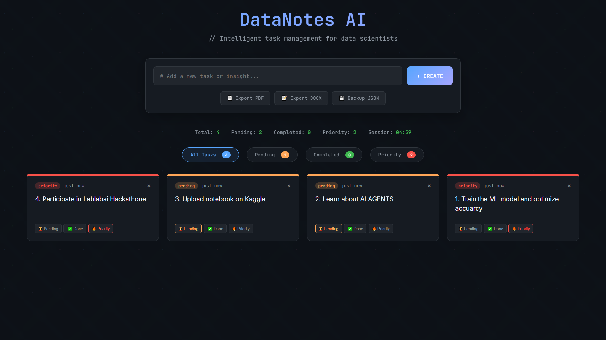
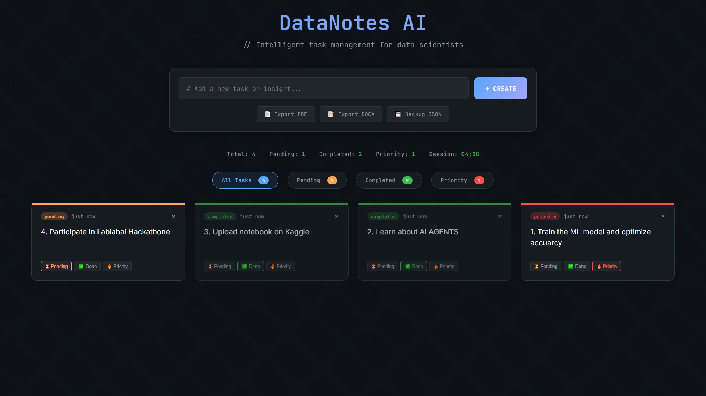
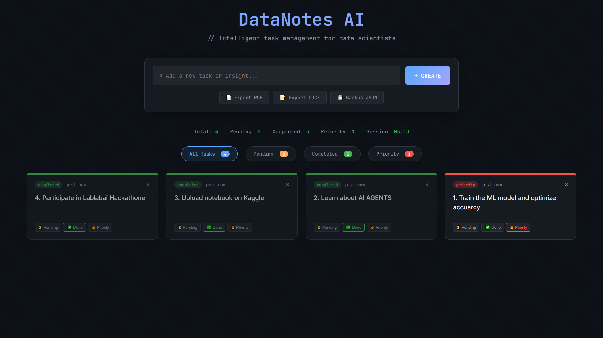
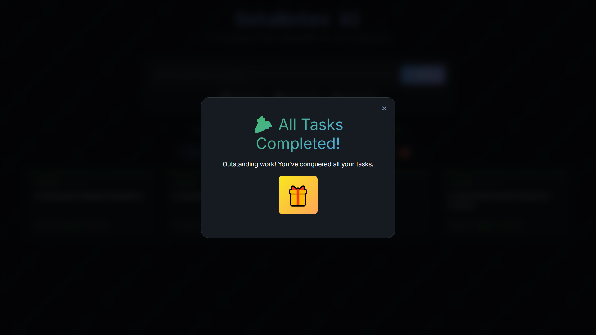
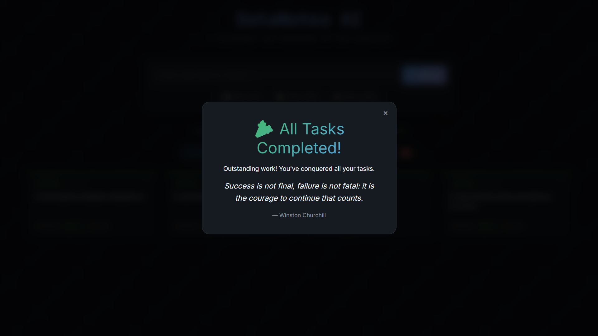

# 🧑‍🔬 Data Scientist To-Do List 📝  

Because data scientists don’t just wrangle data, they also wrangle their lives.  

---

## 🚀 About the Project  
This is a **fun little To-Do List app** I built for myself — but hey, it’s deployed on **Vercel**, so anyone can use it!  
Whether you’re forgetting to write that SQL query, or just need to remind yourself to touch grass 🌱, this app’s got your back.  

**Key Features:**  
- ➕ Add tasks like “Fix random seed” or “Convince model to stop overfitting.”  
- ✅ Mark tasks as done (finally, some closure).  
- ❌ Delete tasks (just like we delete columns we don’t understand).  
- 🎁 **Special Reward:** Complete ALL your tasks and unlock a **gift with a motivational quote**. Because sometimes you deserve more than just an empty list.  
- ☁️ Fully deployed on Vercel — use it anywhere, even while crying over Kaggle.  

---

## 🛠️ Tech Stack  
- **Frontend:** HTML + CSS
- **Deployment:** Vercel  
- **Motivation:** 3 cups of coffee ☕  

---

## 🔧 How to Use  
1. Open the app 👉 [Live Demo](your-vercel-link).  
2. Add your to-do tasks.  
3. Check them off like a boss.  
4. If you manage to complete **all** tasks → 🎉 Surprise gift + motivational quote waiting for you!  
5. Repeat steps 1–4 until you achieve inner peace (or a working ML model).  

---

## 🖼️ Screenshots  
Here’s what the app looks like:  

  

---

## 🤓 Why?  
Because every data scientist needs version control for their brain.  

---

## 🧑‍💻 Author  
Built with ❤️ (and too much caffeine) by [Muhammad Faizan](https://github.com/faizan-yousaf).  
